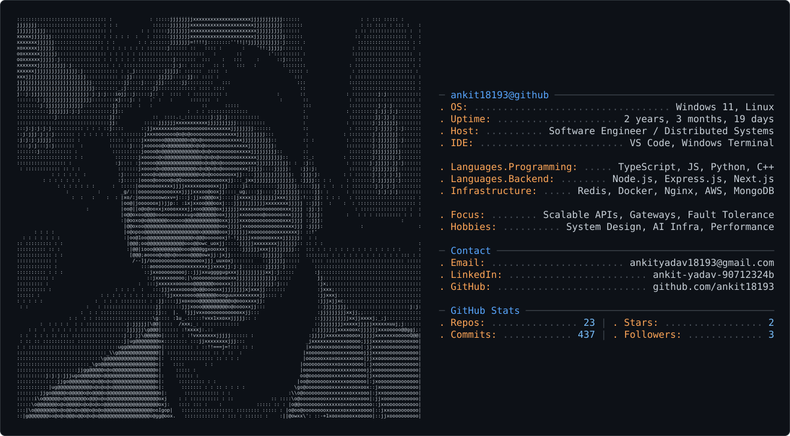
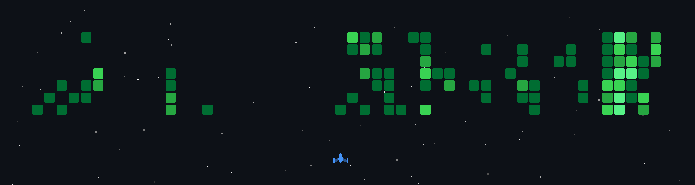
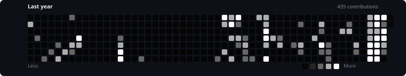

<picture>
  <source media="(prefers-color-scheme: dark)" srcset="dark_mode.svg" />
  <source media="(prefers-color-scheme: light)" srcset="light_mode.svg" />
  
</picture>

<h1 align="center">
  Hey there, I'm Ankit 👋
</h1>

  

<h2 align="center">👨‍💻 About Me</h2>

<table align="center">
<tr>

<td width="65%" valign="top">

- 🧠 Backend-focused Software Engineer building scalable, reliable, production-oriented systems.
- ⚙️ Interested in distributed systems, system design, performance engineering, and backend infrastructure.
- 🚀 Building <b>IntelliGate</b> — an AI-powered gateway focused on adaptive request handling, resilience, caching, and intelligent traffic management.
- 🔧 Building <b>CoreForge</b> — an enterprise backend infrastructure platform designed around modularity, reliability, and scalable architecture.
- ☁️ Working with TypeScript, Node.js, Redis, MongoDB, AWS, Docker, and modern AI/LLM technologies.
- 🧪 I enjoy stress-testing systems, finding bottlenecks, understanding failure modes, and improving what breaks.
- 🌌 Outside engineering, I enjoy exploring AI, astronomy, art, and ideas worth building.

</td>

<td width="35%" align="center" valign="middle">

</td>

</tr>
</table>

<h2 align="center">💻 Tech Stack</h2>

  

<h2 align="center">👾 Contribution Invasion</h2>

<h2 align="center">📊 Contribution Activity</h2>

  

  Less activity → More activity

<h2 align="center">📈 GitHub Analytics</h2>

<h2 align="center">🌐 Let's Connect</h2>

